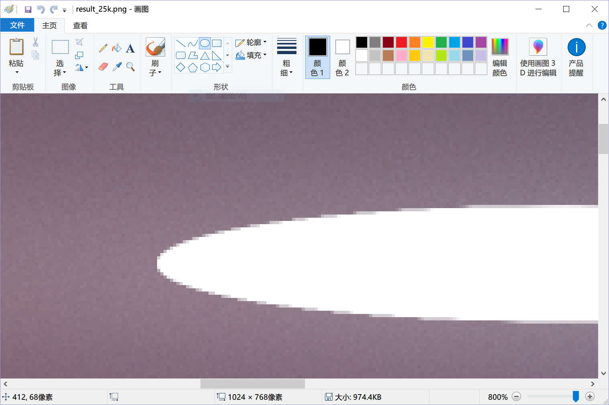
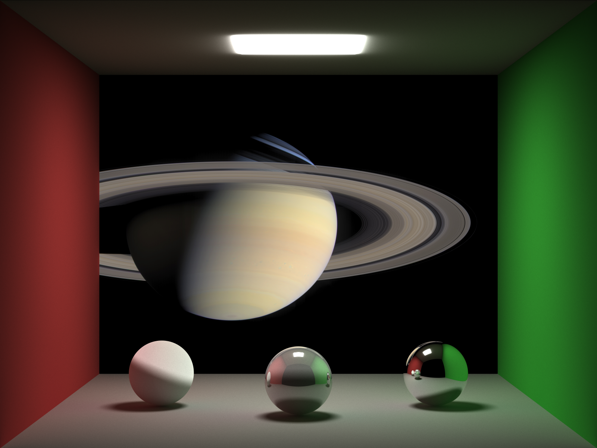
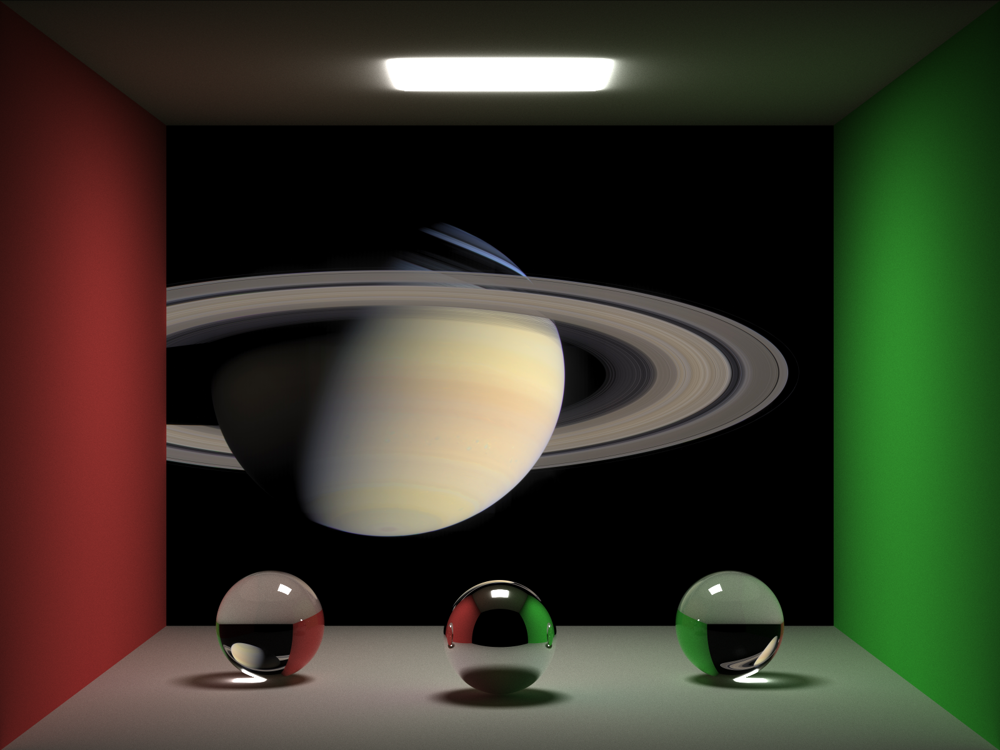
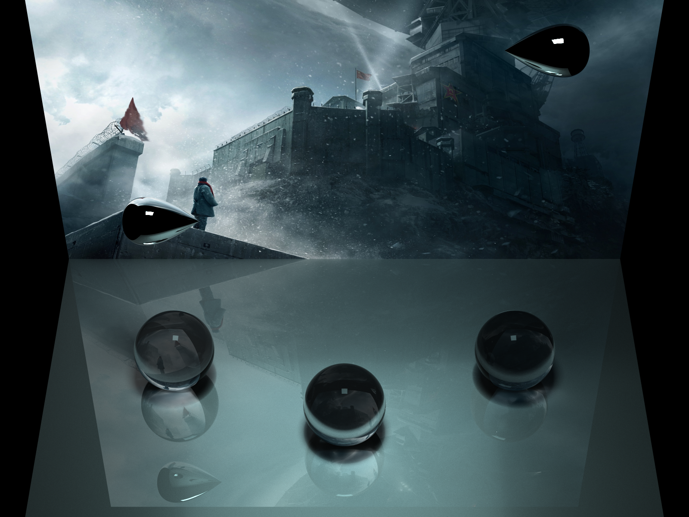

# 2018B-CG-WaterDrop

本项目实现了参数曲面“水滴”和其他部分简单形状的路径跟踪（Path Tracing）渲染。本 README 和 [wd_math.pdf](wd_math.pdf)（“水滴”的数学描述） 构成项目报告的全部内容。

## 特性

### 路径跟踪（Path Tracing）

目前实现的材质有非透明、透明和 LED 屏幕（见下文）三种，见 `OpaqueObject` 模板类、`SolidColorOpaqueBase` 类、`LEDOpaqueBase` 类、`TransparentObject` 模板类，定义于 [objects.hpp](objects.hpp)。相机发出的光线投射到非透明物体表面时，有可能被截止，也可能发生漫反射、镜面反射，发生以上三种结果的概率可以设定；同时非透明物体自身可以发光，发光强度可以设定为零或非零。相机发出的光线投射到透明物体表面时，有可能被截止，也可能发生镜面反射或折射，其中截止概率可以设定，而发生镜面反射以及折射的概率符合菲涅耳方程对反射光强和折射光强比例的约束（本项目使用 Schlick 近似以降低计算量）。

从物理角度来说，只要没有能量损失，一条光线可以发生无数次反射或折射，而这在渲染中会造成无限递归。一些路径跟踪的实现会显式约束递归深度上限，即光线发生若干次偏转后必然会被截止。本项目采取了另一种做法，即设定截止概率，能同样达到防止无限递归的效果，且保留绘制出更深的细节的可能。若光线未被截止，则对光线光强进行增益，使最终渲染结果的全局亮度不受到截止概率的影响。

另外还定义了一些简单形状，以及参数曲面“水滴”，这些形状定义于 [geometry.hpp](geometry.hpp)。

### 参数曲面“水滴”

见 `WaterDrop` 类，定义始于 [geometry.hpp](geometry.hpp) 第 100 行。在小说《三体》中，“水滴”是一种形状与水滴相似的飞行器，拥有全反射镜面。参数曲面“水滴”的数学描述见 [wd_math.pdf](wd_math.pdf)。

### 抗锯齿

采取了两种措施。

#### 超采样

见 `Camera::transmit()` 函数，定义始于 [objects.hpp](objects.hpp) 第 128 行。这里的做法与那些将单个像素若干等分的做法不同。本项目在绘制某个像素时，随机选取该像素所对应的场景中的矩形的内部任一点（以均匀分布），然后构造从相机原点到该点的光线并发出。在渲染时间足够长的情况下，该做法可以达到趋于无限大的采样密度。

#### 微调光源位置

光源处的亮度一般很高，可达漫反射区的十倍以上，同时光源边缘的亮度梯度也很大。本项目实现中，若亮度的某个分量大于 1，则将其等同于 1，因此在画面中亮度变化剧烈的位置仍会有明显的锯齿，且超采样效果有限。这里给出 smallpt 的例子对此进行说明：

 

本项目采取了一个简单的方法。将天花板处的光源略微下移，使天花板直接得到光源照明，这会得到亮度弥散的效果，一定程度上可以改善锯齿情况。具体效果见下文 saturn 场景。

### 贴图

见 `LEDOpaqueBase` 类，定义始于 [objects.hpp](objects.hpp) 第 80 行。`LEDOpaqueBase` 类模拟 LED 屏幕，在表面上不同的点可以有不同的发光强度，其他性质与不透明材质相同。

### 软阴影

软阴影为路径跟踪的原生特性，不需要引入额外的代码。

## 加速

### 包围盒

见 `WaterDrop::intersects_with()` 函数，定义始于 [geometry.hpp](geometry.hpp) 第 116 行。具体的做法见 [wd_math.pdf](wd_math.pdf)。

### OpenMP

见 `objects.hpp` 第 174 行。图像不同的行可以交给不同的线程进行渲染。

## 效果

所有场景均定义于 [scenes.hpp](scenes.hpp) 中。

### saturn

见 `scenes::saturn` 命名空间。每像素发出 200000 条光线。

### saturn2

为专门体现焦散效果，更改 saturn 场景中的三个球的材质得到新场景 saturn2。每像素发出 100000 条光线。

### threebody

见 `scenes::threebody` 命名空间。每像素发出 35000 条光线。

## 参考资料

1. [smallpt: Global Illumination in 99 lines of C++](http://www.kevinbeason.com/smallpt/)

2. [用 C 语言画光（六）：菲涅耳方程 - 知乎](https://zhuanlan.zhihu.com/p/31534769)

3. [Trinkle23897/Computational-Graphics-THU-2018: Computational Graphics - THU Spring 2018](https://github.com/Trinkle23897/Computational-Graphics-THU-2018)

4. [三体 海报](https://movie.douban.com/photos/photo/2249132272/)（贴图来源）

5. [土星 - 维基百科，自由的百科全书](https://zh.wikipedia.org/zh/%E5%9C%9F%E6%98%9F)（贴图来源）
